<span style="text-decoration:underline;">Design Brief ID5415</span>

# Team 6 members:

Jordan Kelly		- 4917189

Casper Beers		- 4975421

Karsten Bakker	- 4278887


ID5415 - Prototyping Connected Products

Final report- Team 6


---


Submission date: Monday 4th November 2019

Team members:


Jordan Kelly - 4917189

Casper Beeris - 4975421

Karsten Bakker - 4278887


---


**Contents:**


1. Introduction
2. Concept description
3. Method
4. Recommendations
5. Reflection

1. Introduction

    This report serves to outline the design development process for the WheelCare system - a connected Internet of Things product that hopes to aid in the improvement of facilities for wheelchair users.


    This project is being completed as part of the ID5415 Prototyping connected products elective as  part of the MSc Integrated Product Design course at TU Delft, Netherlands.


    The project brief is as follows:


    _‘While the population of wheelchair users is growing worldwide, it becomes urgent to design supportive technologies that fit their needs. We aim to develop products for improvement of the wheelchair users’ well-being. This design is a connected product that collects data from sensors, processes it in order to actuate user interactions embedded on the wheelchair.’_


The project hopes to integrate the local computing system into an internet-based data management platform, where the gathered information can be processed and made into comprehensible insights for the users of the system. and About the Internet of Things:

2. Concept description

The WheelCare system is an IoT device used to identify locations and hazards that are unsafe or unsuitable for wheelchair users. Using the device, movement and location data can be captured and accessed online, where wheelchair users can be warned about treacherous or difficult journeys. Furthermore, this information can be used by government bodies and proprietors alike to make improvements to their buildings and facilities.


Should a user encounter a potential hazard or unsuitable terrain they can log this to the online site by using the system’s button module.  An accelerometer module affixed to the chair’s frame then logs a period of movement data and transmits this to the cloud where it is processed to identify the scale or type of the hazard. This information is then available to view on a map, to chart an area’s risks and their severity for wheelchair users.

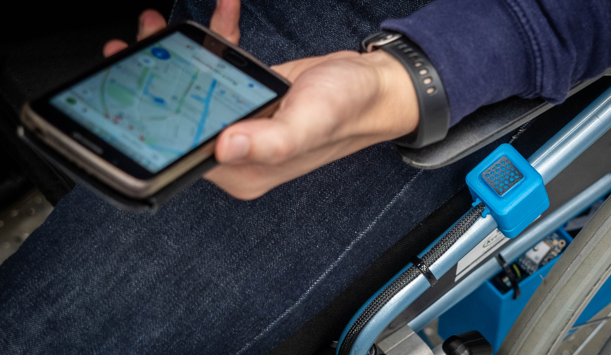

The system architecture is described in the above diagram. At the heart is a Raspberry Pi, which is used to capture and send data to the cloud. An Arduino Mega microcontroller is responsible for operating the accelerometer and the push-button module.


It is hoped that the system will be purchased by wheelchair users who want to ensure a more convenient and autonomous life by foreseeing and thus avoiding potential hazards that might otherwise require assistance. Likewise, government bodies and proprietors who wish to provide safe and wheelchair-friendly facilities can purchase this system for use in mapping and research applications.


The local system is powered using a standard power bank, and can operate for up to FIXME hours on a single charge.


The online platform makes use of TU Delft’s Data Centric Design Hub for the information processing system.


The local system represents the integration of the coding languages C++ and Python, and the online platform utilises HTML, CSS & JavaScript.

System diagam:

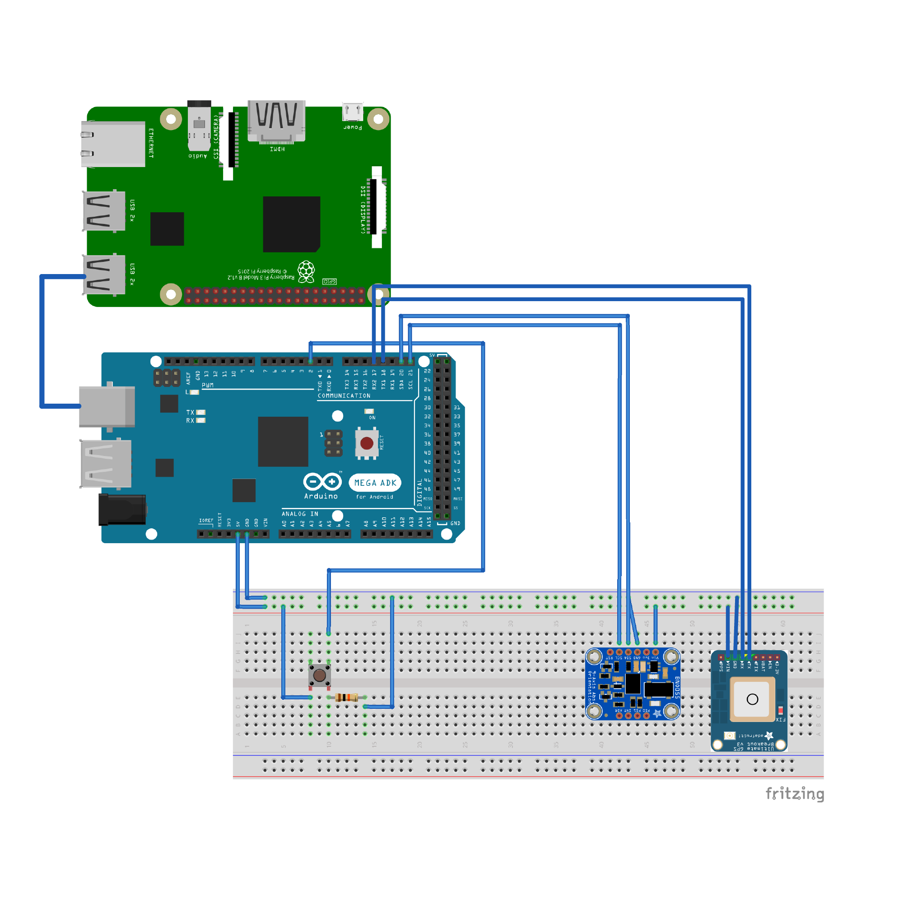


**Tutorial:**

**How to built a “city wheelchair problem mapping” prototype? **

**For Beginners**

The aim of of this tutorial is to get the basic principles of IoT connected products, learning about the (coding) requirements and setting up connections to be able to gain practical skills. This with the goal to translate connect concepts ideas in concrete functional prototypes.

Goal & Purpose

For this project the purpose of this prototype was to validated the accuracy of the GPS data in an outdoor environment. Additionally this prototypes allows to gather insights in the the experience of individuals marking problems in the city.

<span style="text-decoration:underline;">In this tutorial you will learn about the main following subjects:</span>


*   C++ coding of arduino GPS module
*   Collecting IMU data
*   Extracting and emitting clean data sensorry data
*   Installation of raspberry Pie
*   Set-up website server on raspberry pie
*   Connecting and processing data from serial port (arduino) to webserver
*   Integrating Google API’s in your system
*   Emitting GPS data from physical to online digital prototype
*   Collecting and storage of sensory data on a hub  

**<span style="text-decoration:underline;">Required Materials:</span>**


*   3D printer or casing prototype toolings,
*   press button,
*   M3 x 20mm SHCS bolts,
*   M3 X 5mm brass inserts
*   hot glue,
*   Wheelchair
*   wiring,
*   Resistor
*   Zero PCB
*   Soldering materials
*   IMU arduino sensor type
*   GPS Module
*   Rasberry Pi
*   Digital Button


**Tips & Tricks: General and basic instructions to take into account when executing this (IoT) project.**


*   Ensure individual pieces of the code or prototype work before setting up connections. If possible test. For example by options like: serial monitor, saving data to file, loading fake data in file, or
*   For debugging output to a web server use right mouse click “inspect” to find errors not appearing in your coding program.
*   Integrated print() functions in between lines of code to validate the output of your program
*   Note that setting up IoT connections are in general difficult. Testing pieces of code individually could ease tackling this complexity. Recommended when rewriting files is to make a backup from the last operating status.

3. Method:

    1. Concept Selection

To begin, a period of brainstorming was conducted with the team members to choose a suitable wheelchair-based solution.


    **To give expensive IoT devices the right to exists incentives to share data are of big interest:**


Therefore the the following were seen as a problems and solutions taken in to account:


| Wishes | Solutions |
|--------|-----------|
| Wheelchair users should be **motivated to share** their data | sharing data is allows wheelchair user to **get their problems solved** by municipalities|
|Wheelchair users should **benefit from the data** | Wheelchair users can avoid obstacles in cities And thereby **travel safer and faster** |
| Wheelchair data is of **interest to third parties**(municipalities) | Municipalities get **direct customers feedback** in a structured way |


Firstly, a range of sensors and actuators were established. Next, the team identified potential applications of the technologies. From this, three concepts emerged….?


    2. **Hardware development**


The development process for the Wheeall Care system followed a process of four iterative cycles:

1. Foundation
2. Connection
3. Collection
4. Analysis

**Phase 2: Connection**

In this design phase the discrete electronic, web, and hardware components were compiled into a one integrated system. This process will be detailed per each respective part of the system. For the required resources and further information please follow the provided links.


**Hardware development:**

The prototype features three 3D printed hardware components located at three locations on the frame of the wheelchair. Each part was modelled using Fusion 360 and printed using a Prusa I3 MK3s FDM printer in PLA material.

The part files are available to download here:
3.mf files are used specifically, as the printing parameters are contained within the file, according to our recommended settings and performance requirements.


The housings are employed to achieve the following goals:

*   To house the electronic components on the frame of the wheelchair, ensuring that they are held stably during folding and unfolding of the wheelchair.
*   To protect them from environmental conditions such as dirt, rain and UV damage.
*   To securely affix the IMU in place on the frame, ensuring repeatability and validity between various readings. Should the sensor move throughout its lifetime, the way in which accelerometer data recorded across the three axes may change, resulting in incorrect or inaccurate labelling.
*   To provide ease of use for users with reduced hand dexterity and motor function when interacting with small features (such as push-buttons and power switches).

In total, three iterations of housings were made. Incremental improvements were made to the system as follows:


**MK1 housings**


Rationale: for the first time integrate the components onto the wheelchair frame.

Description: this iteration proved successful in that the entire system could be integrated within the wheelchair frame, powered on its own source and operating autonomously.

To improve: The zip-tie method for affixing the parts proved unstable, and should be replaced with a bolt-on feature. The location of the electronics housing should be changed to ensure that the wheelchair can be folded and stowed.


**MK2 housings**


Rationale: incorporate bolt-on fixings and test new housing location.

Description: This iteration served as a stepping stone on which to test the relationship of the fixing hardware

To improve: The layout of the internal components must be altered to ensure that the frame can be folded properly.


**MK3 housings**


Rationale: final prototype housing production.


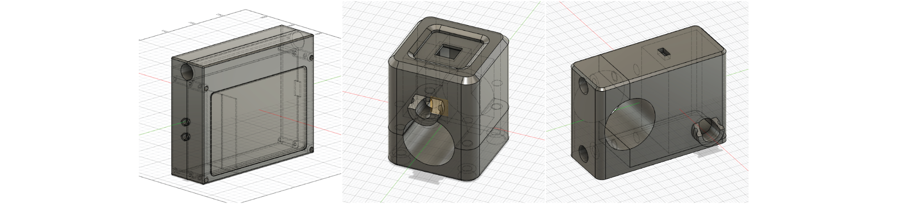


L-R: electronics housing, button holder, IMU holder.


**Assembly of the hardware**

Button module: 

1. Download the .3mf files accompanying this document and 3D print using the reccomended printing parameters.
2. Remove the part brim and remove any sharp edges.
3. Using a the pointed tip of soldering iron heated to 200deg, carefully press in the x4 M3 x5mm brass inserts, such as the below image.

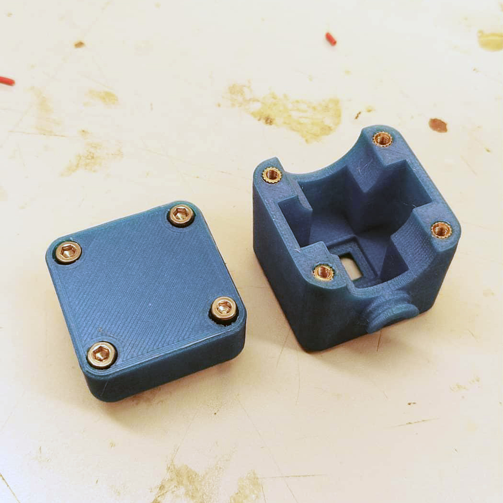

4. Once the electronics have been succesfully integrated (see following steps), affix the button module on the frame of the wheelchair with the M3 x 20mm SHCS bolts. 


IMU module: 

1. Download the .3mf files accompanying this document and 3D print using the reccomended printing parameters.
2. Remove the part brim and remove any sharp edges.
3. Using a the pointed tip of soldering iron heated to 200deg, carefully press in the 2 M3 x5mm brass inserts into the fixing locations, such as the below image.

4. Once the electronics have been succesfully integrated (see following steps), affix the IMU on the frame of the wheelchair with the M3 x 20mm SHCS bolts. 

Electronics encolsure: 

1. Download the .3mf files accompanying this document and 3D print using the reccomended printing parameters.
2. Remove the part brim and remove any sharp edges.

4. Once the electronics have been succesfully integrated (see following steps), carefully place the components within the housing.
5. Using the zip-ties, affix the housing to the underside of the wheelchair frame. 
6. Using zip-ties, route and secure the cables on the frame such that they will not be snagged or pulled. 


    3. **Arduino Microcontroller**

Located on the wheelchair frame, the Arduino Mega2560 microcontroller serves as the first system that the user interacts with in the WheelCare concept


The responsibility of the Arduino Microcontroller is


*   To operate the Adafruit BN055 IMU accelerometer sensor
*   To operate the momentary push-button
*   To operate the Adafruit Ultimate GPS sensor.
*   To relay the captured information via serial connection to the Raspberry Pi.

The system was coded in such a way that:


*   The IMU and GPS sensor were constantly running to capture location and movement data.
*   At the push of a button, ten seconds of IMU data and the current GPS location was sent to the serial monitor.
*   Connected to the Pi via serial, this print of information could be translated to a .csv file by the pi for processing in the DCD hub.

The development process of the Arduino microcontroller was as follows:


1. Push-button added to display ‘1’ when pushed and ‘0’ when not pushed in the Serial monitor.
2. A de-bounce was added to the code to improve the performance of the button.
3. The IMU was added, and programmed to print X, Y and Z Euler angle data stream into the serial monitor.
4. IMU programmed to operate when the push-button is used.
5. IMU programmed to print X number of values, corresponding to ten seconds of data capture.
6. IMU programmed to print the angular acceleration in place of euler angle.
7. GPS module added to the arduino system. Raw data stream printed into the serial monitor.
8. GPS data parsed and formatted to give readable information for the DCD hub.
9. Final code formulated to include x1 GPS location and IMU data in a serial monitor readout once the button is pressed.


Arduino system diagram:

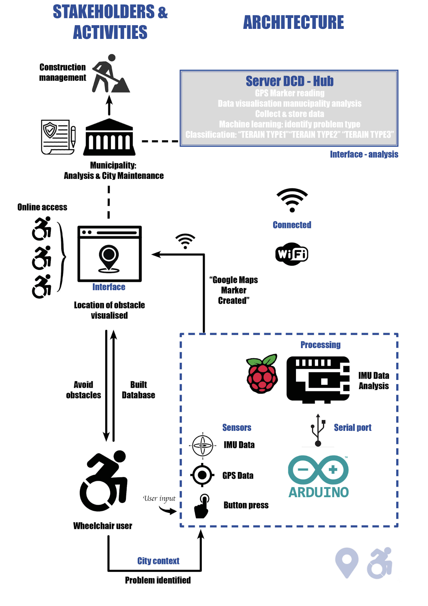

Hardware diagram:

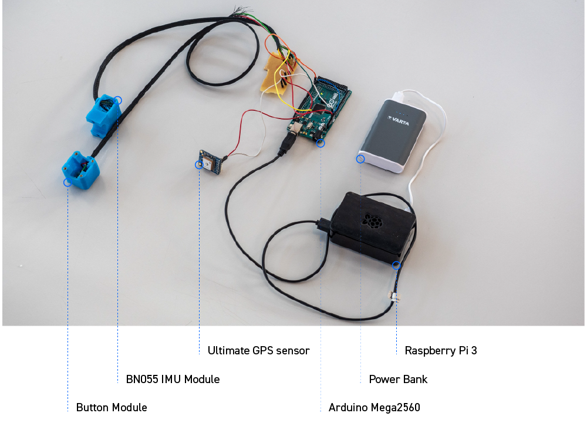


**Assembly Steps**

To assemble the arduino system follow the following steps. A prototyping board is used between the Arduino and the sensors to protect the sensitive arduino in the case that the cables are pulled, and to reduce the chance of connections coming loose. 

1. Cut three lengths of electric cabling approximately 600mm in length, and remove 5mm of plastic covering from each end of the wires.
2. Cut one length of cable shroud approximately 550mm in length.
3. Solder the cable ends to a pin of the push-button. It does not matter which pin of the button is not used. 
4. On the button side with two wires, clearly assign and label GND and Vin on the far end of the wires. It does not matter which is which.
5. Clearly lable the far end of the remaining cable as "digi-pin".
6. Pass the length of cable shroud over the electric wiring. 
7. Pass the cable through the hole orifice on the IMU holder.
8. Solder a 10K ohm resister across the prototpying board, connecting GND and hole 8B.
9. Solder the GND wire to track 1 of the prototyping board.
10. Solder the Vin wire to hole A of the Vin track on the prototpying board.
12. Solder the digi-pin to track 2A of the board. Connect this track to the Arduino digital pin 3. 
12. Glue the button module in place on the 3D printed part.
13. Glue the button pad in place on the button module.

14. Connect the GPS Vin pin to hole B on the Vin track. 
15. Connect the GPS GND to pin B on the GND track. 
16. Connect the GPS Rxx pin to pin Txx on the Arduino. Ensure the correct setup before proceeding.
17. Connect the GPS Txx pin to pin Rxx on the Arduino. Ensure the correct orientation before proceeding. 

18. Cut four lengths of electric cabling approximately 400mm in length, and remove 5mm of plastic covering from each end of the wires.
19. Cut one length of cable shroud approximately 450mm in length.
20. Solder the cable ends to a pin of the push-button.
21. Clearly label each cable.
22. Pass the length of cable shroud over the electric wiring. 
23. Pass the cable through the hole orifice on the IMU holder. 
24. Connect the Vin pin on the IMU unit to hole C on the Vin track of the prototypting board.
25. Connect the GND pin on the IMU to hole C on the GND track of the arduino. 
26. Connect the SCL pin of the IMU to the SCL pin of the Arduino.
27. Connect the SDA pin of the IMU to the SDA pin of the Arduino.

28. Connect the Vin pin D of the prototyping board to the 5V Vin pin of the Arduino.
29. Connect the GND pin of the prototyping board to the GND pin of the Arduino.


30. Connect the Arduino via USB connection to your PC. 
31. In the Arduino IDE environment, load and upload the following code. 
32. Remove the Arduino and conenct it via USB to pin 4 of the Pi.

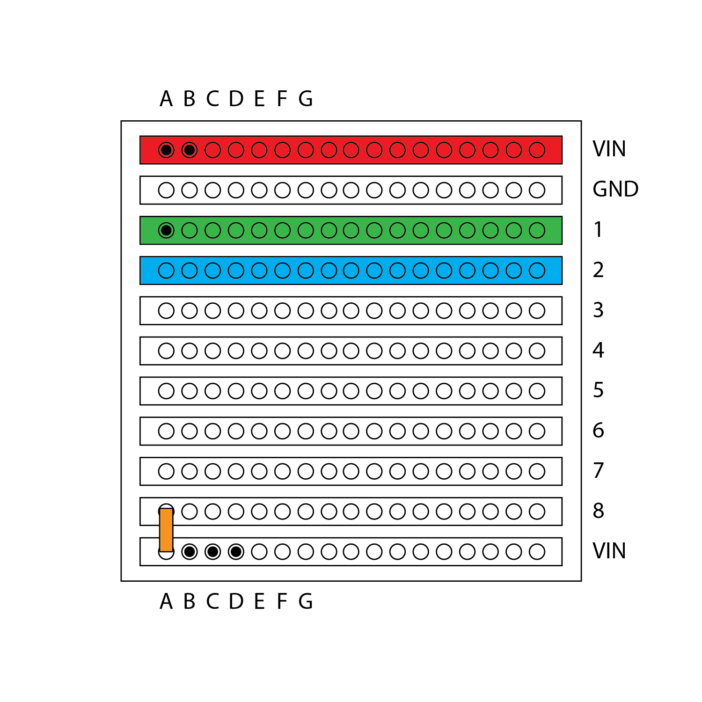

**ARDUINO CODE**

```

// HERE WE ARE GOING TO DEFINE SOME VARIABLES THAT CAN BE RECALLED LATER IN THE SCRIPT //

const int buttonPin = 2;        // declare the number of the pushbutton pin
int buttonState = 0;            // variable for reading the pushbutton status
long lastDebounceTime = 0;      // the last time the output pin was toggled
long debounceDelay = 50;        // the debounce time; increase if the output flickers
uint32_t timer = millis();      // set the counter time
Adafruit_GPS GPS(&GPSSerial);   // define some serial stuff
Adafruit_BNO055 bno = Adafruit_BNO055(55, 0x28);   // some details about the sensor

// HERE WE ARE GOING TO INCLUDE SOME LIBRARIES USED TO RUN THE SENSORS AND INTERPRET THE DATA //

#include <Wire.h>               // include this library for the sensor to work
#include <Adafruit_Sensor.h>    // include this library for the sensor to work
#include <Adafruit_BNO055.h>    // include this library for the sensor to work
#include <utility/imumaths.h>   // include this library for the sensor to work
#include <Adafruit_GPS.h>       // include the GPS library for the sensor to work

// HERE WE DEFINE SOME FACTORS AND ATTRIBUTES OF THE SCRIPT AND ITS COMPONENTS //

#define GPSSerial Serial1                          // define the serial hardware used here for the GPS sensor
#define BNO055_SAMPLERATE_DELAY_MS (100)           // set the time delay between accelerometer readings
#define GPSECHO false                              // set the echo to false otherwise raw data is pumped out

// HERE WE DEFINE THE SCRIPT USED TO DISPLAY THE IMU SENSOR DETAILS //

void displaySensorDetails(void)         // Function to read sensor details in the serial monitor
{
  sensor_t sensor;                      // Get the sensor details from the chip
  bno.getSensor(&sensor);               // Get the sensor details from the chip
  delay(500);
}

// HERE WE DEFINE THE FUNCTION USED TO READ AND PRINT THE STATUS OF THE IMU SENSOR //

void displaySensorStatus(void)          // Function to display sensor details in the serial monitor
{

  uint8_t system_status, self_test_results, system_error;                     // Get the system status values (mostly for debugging purposes) //
  system_status = self_test_results = system_error = 0;                       // Get the system status values (mostly for debugging purposes) //
  bno.getSystemStatus(&system_status, &self_test_results, &system_error);     // Get the system status values (mostly for debugging purposes) //
  delay(500);
}

// HERE WE DEFINE THE FUNCTION USED TO DISPLAY THE CALIBRATION DETAILS OF THE IMU CHIP //

void displayCalStatus(void)                                   // Function to read sensor calibration details in the serial monitor
{

  uint8_t system, gyro, accel, mag;                           // Get the four calibration values (0..3) //
  system = gyro = accel = mag = 0;                            // Any sensor data reporting 0 should be ignored //
  bno.getCalibration(&system, &gyro, &accel, &mag);           // 3 means 'fully calibrated" //

  Serial.print("\t");
  if (!system)                     // The data should be ignored until the system calibration is > 0 //
  {
    Serial.print("! ");
  }
  Serial.print("Sys:");            // Display the individual values //
  Serial.print(system, DEC);       // Display the individual values //
  Serial.print(" G:");             // Display the individual values //
  Serial.print(gyro, DEC);         // Display the individual values //
  Serial.print(" A:");             // Display the individual values //
  Serial.print(accel, DEC);        // Display the individual values //
  Serial.print(" M:");             // Display the individual values //
  Serial.print(mag, DEC);          // Display the individual values //

}

// HERE IS THE FUNCTION TO OPERATE THE IMU SENSOR AND PRINT THE DETAILS IN THE SERIAL MONITOR //

void getdata() {                            // Function to read sensor details and display them in the serial monitor

  sensors_event_t event;                    // Fetch data from the sensor //
  bno.getEvent(&event);                     // Fetch data from the sensor //

 imu::Vector<3> accel2 = bno.getVector(Adafruit_BNO055::VECTOR_ACCELEROMETER);    // function to translate sensor data into useful vector information //

// HERE IS HOW WE WANT THE DATA TO BE PRINTED IN THE SERIAL MONITOR SO THAT IT CAN BE INTERRETED BY THE DCD HUB //

  Serial.print("IMU2,");         // Display the floating point data //
  Serial.print(accel2.x());      // Display the floating point data //
  Serial.print(", ");            // Display the floating point data //
  Serial.print(accel2.y());      // Display the floating point data //
  Serial.print(", ");            // Display the floating point data //
  Serial.print(accel2.z());      // Display the floating point data //
  Serial.print("\t\t");          // Display the floating point data //

  int i= i+1 ;                              // i increases - used for setting data read time //
  Serial.println("");                       // New line for the next sample //
  delay(BNO055_SAMPLERATE_DELAY_MS);        // Wait the specified delay before requesting nex data //
}

// HERE IS THE FUNCTION USED TO SETUP AND CONFIGURE THE ARDUINO ONCE IT IS POWERED ON //

void setup() {

  pinMode(buttonPin, INPUT);          // Declare the button as an input //
  Serial.begin(115200);               // Set the baud rate of the serial monitor //

  if(!bno.begin())                    // Initialise the sensor //
  bno.setExtCrystalUse(true);

// SCRIPT USED TO SETUP AND INITIALISE THE GPS SENSOR //

  GPS.begin(9600);                                              // declare GPS data read speed //
  GPS.sendCommand(PMTK_SET_NMEA_OUTPUT_RMCGGA);                 // send the NMEA capture command to the sensor for RMCGGA data //
  GPS.sendCommand(PMTK_SET_NMEA_OUTPUT_RMCONLY);                // send the NMEA capture command to the sensor for RMConly data //
  GPS.sendCommand(PMTK_SET_NMEA_UPDATE_1HZ);                    // 1 Hz update rate //
  GPS.sendCommand(PGCMD_ANTENNA);                               // Display the floating point data //
  delay(1000);                                                  // Delay //
  GPSSerial.println(PMTK_Q_RELEASE);                            // print release version //
}

// HERE IS THE CONTINUOUS SCRIPT USED TO RUN THE ARDUINO ONCE THE SETUP LOOP IS FINISHED //

void loop() {

// HERE WE MAKE THE GPS CHIP SEND AND RECEIVE COMMANDS FROM THE SATELLITES, AND THEN FORMAT IT INTO USABLE INFORMATION //

  char c = GPS.read();                        // Read the GPS sensor //
  if (GPSECHO)                              // if echo function data is captured in this script //
  if (c) Serial.print(c);                   // if data is received from the sensor then parse and print it //
  if (GPS.newNMEAreceived()) {              // if new NMEA data is received //
  if (!GPS.parse(GPS.lastNMEA()))           // this also sets the newNMEAreceived() flag to false //
  return;                                   // we can fail to parse a sentence in which case we should just wait for another //

// HERE WE ASSESS HOW LONG IT HAS BEEN SINCE THE BUTTON HAS BEEN PRESSED IN ORDER TO OVERCOME NOISE AND MECHANICAL POOR PERFORMANCE (DEBOUNCE) //

  buttonState = digitalRead(buttonPin);                       // Sample the state of the button - is it pressed or not? //
  if ( (millis() - lastDebounceTime) > debounceDelay) {       // Filter out any noise by setting a time buffer //

  if (buttonState == HIGH)  {                                       // if the button has been pressed //

// HERE IS THE FUNCTION USED TO PRINT THE GPS DETAILS TO THE SERIAL MONITOR //

      Serial.print ("GPS,") ;                                       // print the GPS tag //
      Serial.print(GPS.latitude, 4); Serial.print(GPS.lat);         // print the GPS latitude data //
      Serial.print(", ");                                           // print a comma //
      Serial.print(GPS.longitude, 4); Serial.println(GPS.lon);      // print the GPD longtitude data //

// HERE WE CALL THE IMU READ FUNCTION TO HAPPEN 100 TIMES //

 for (int i = 0; i <= 100; i++) {                      // Call the data capture to happen in a desired number of instances of  i (rising) (100) //

// RUN THE VOID FUNCTION DECLARED EARLIER IN THE SCRIPT TO READ FROM THE IMU //

   getdata() ;                                                // Trigger the data capture function

}}

//HERE WE RESET THE CLOCK TO SEE IF THE BUTTON HAS BEEN PRESSED AGAIN //

   lastDebounceTime = millis();                         //reset the current time

  } }}


```


 \


    4. Raspberry Pi

**Goal**

The goal of the raspberry pi is to serve as a hub between the arduino, webserver and dcd hub. When information comes in at the RPi it will process it. The imu data will be compared to a trained model in such a way that the outcome of this model is a label that can be sent to the dcd hub which serves an interface for the municipality. Furthermore the RPi runs the web server that shows the locations of hazzards for wheelchair users from a website.

**Steps**

Development of the Rpi was done using a stepwise incremental approach. This helped reduce the complexity and determining the cause of errors that we came across. We started building connections based on random data. Saving actual data and running a blank webpage. And developed these further to combine their functionalities and converting them to services.

Random to dcd

Serial to terminal

Serial to CSV

Serial to dcd

Blank server

Random to server

Serial to server

**Processing**

Collecting

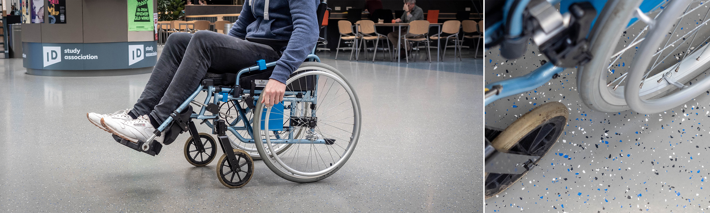
Flat ground - nominal Terrain

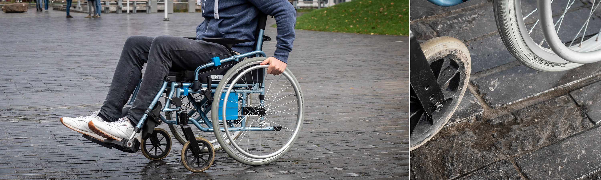
Cobblestones - light terrain

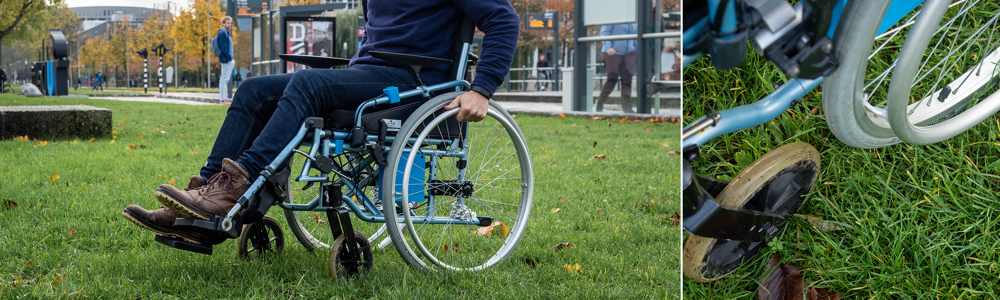
Grass - intermediate terrain

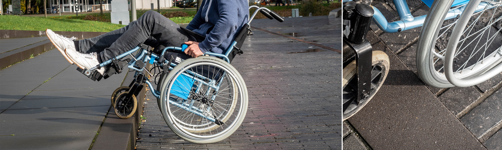
Steps - extreme terrain

Processing

Labeling

Training

Predicting

**Services**

Eduroam service

Webservice

Ip service

**Current and furture state**

The Rpi is able to receive, process


    5. Web platform

    Concept evaluation matrix


    Task designated to others


    Reflection:


    Please give critical feedback on decisions matrix flow chart  - might be some lines wrong or we could add stuff


<table>
  <tr>
   <td>
#
   </td>
   <td>Arguments for decision / reflection on decisions / improve for future prototype
   </td>
  </tr>
  <tr>
   <td>1.
   </td>
   <td>- Because our project group was familiar with working with Arduino the GPS module allowed us to rapidly make progress in gathering clean GPS data.
<p>
-We looked in to extracting GPS data by the phone as this would allow our prototype to communicate via 4G with our server. The connection from phone to hub was eventually not satisfactory because ….????
<p>
- No information on the Lora GPS module could be found to get it to work in the time available.
<p>
The arduino GPS data turned out to be precise but not too accurate. Additionally this module provide restrictions in freedom of movement as it required a connected to the local WiFi to collect GPS data. In the future an added SIM-card module/phone/lora connection interesting to look into. Nonetheless this solutions was feasible to for setting up our prototype
   </td>
  </tr>
  <tr>
   <td>2.
   </td>
   <td>-
<p>
-
<p>
-
   </td>
  </tr>
  <tr>
   <td>3.
   </td>
   <td>-
<p>
-
<p>
-
   </td>
  </tr>
  <tr>
   <td>4.
   </td>
   <td>-
<p>
-
<p>
-
   </td>
  </tr>
  <tr>
   <td>5.
   </td>
   <td>-
<p>
-
<p>
-
   </td>
  </tr>
  <tr>
   <td>6.
   </td>
   <td>-
<p>
-
<p>
-
   </td>
  </tr>
  <tr>
   <td>7.
   </td>
   <td>-
<p>
-
<p>
-
   </td>
  </tr>
  <tr>
   <td>8.
   </td>
   <td>-
<p>
-
<p>
-
   </td>
  </tr>
  <tr>
   <td>9.
   </td>
   <td>-
<p>
-
<p>
-
   </td>
  </tr>
  <tr>
   <td>10.
   </td>
   <td>-
<p>
-
<p>
-
   </td>
  </tr>
  <tr>
   <td>11.
   </td>
   <td>-
<p>
-
<p>
-
   </td>
  </tr>
</table>

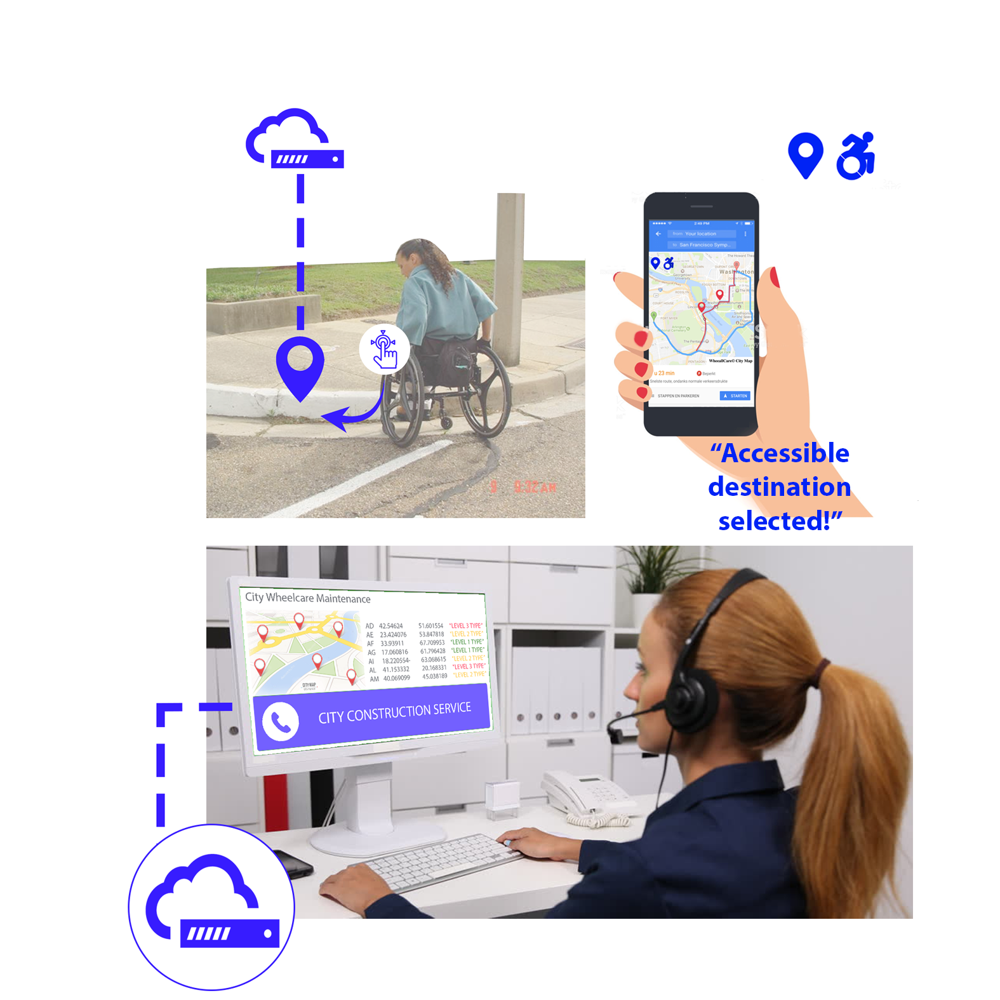

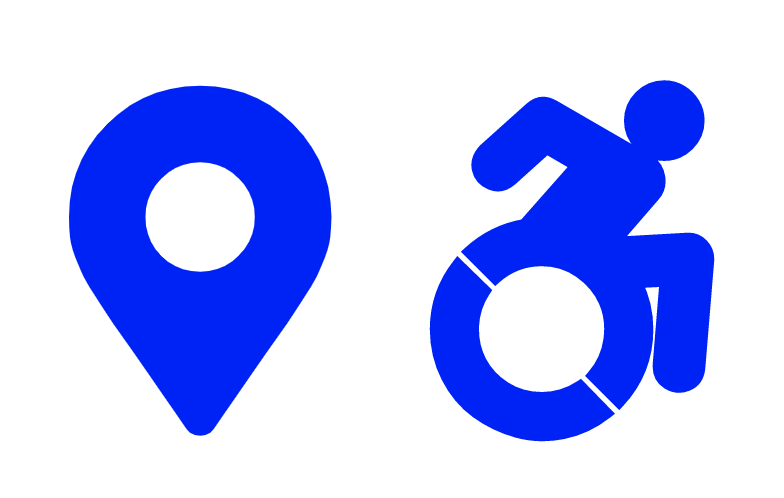


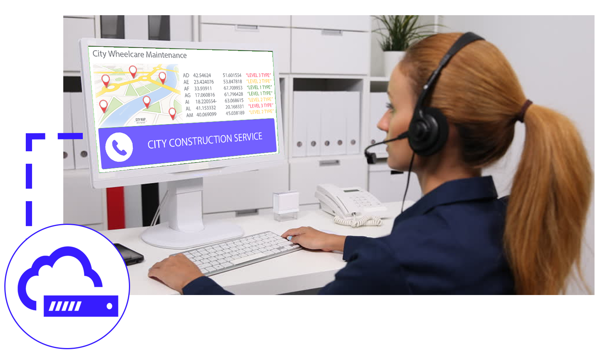


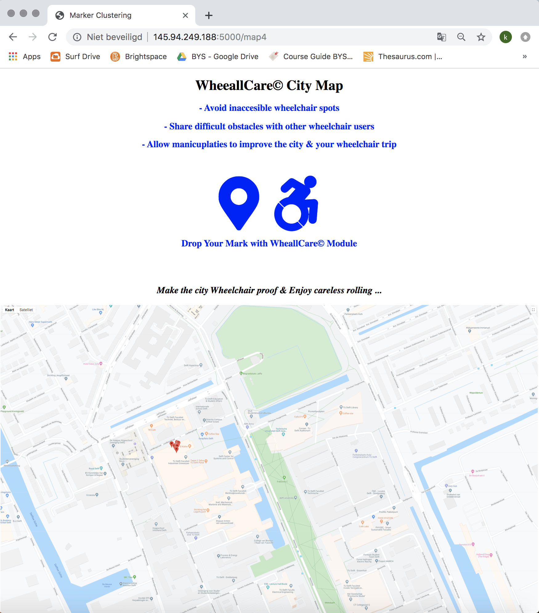
